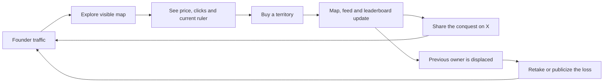

# WARMAP.lol: product, growth and technical analysis

**Research date:** 3 September 2026  
**Subject:** [warmap.lol](https://warmap.lol/)  
**Purpose:** identify the mechanics worth adapting for StartupMap and the mistakes to avoid.

## Executive summary

WARMAP is not primarily a map directory. It is a perpetual, pay-to-takeover advertising game presented as a geopolitical map. A buyer pays to place a name, color, favicon and tracked link on a territory. Another buyer can replace them by paying at least 1.5 times the previous bid. The previous owner is not paid and does not receive a refund; the operator captures each transaction.

The map is the interface, scarcity device and shareable artifact at the same time. The strongest loop is:



The public state captured during this research contained 194/194 claimed territories, 365 successful claim events, 34,385 outbound clicks and 32,235 visitors. Eighty-nine territories had changed hands at least once. This is meaningful evidence that the takeover loop worked, but not proof of durable demand: the latest event in the 40-item public feed was dated 1 September, two days before this review.

For StartupMap, the useful lesson is to combine geographic discovery with visible activity, social proof and measurable exposure. The dangerous lesson is to let payment determine the truth layer. StartupMap should remain a credible startup directory; sponsorship should be clearly separated from startup data and rankings.

## Scope and confidence

The analysis is based on:

- the rendered and server-returned WARMAP pages;
- public client bundles and CSS loaded by the site;
- the public [`/api/state`](https://warmap.lol/api/state) response;
- the public [`/api/history/US`](https://warmap.lol/api/history/US) response;
- HTTP response headers observed on 3 September 2026;
- third-party launch and revenue tracking from [Weird Revenue](https://weirdrevenue.com/projects/warmap) and [All Lol Rank](https://allrank.lol/sites/warmap-lol).

No purchase, checkout, authenticated action, penetration test or destructive request was performed. Backend/database choices that are not exposed publicly are intentionally not guessed.

Facts directly observed in the site or API are marked as such. Product interpretations, risks and StartupMap recommendations are analysis.

## 1. Product model

### Core offer

A territory owner receives:

- their chosen brand color on the map;
- a favicon/logo resolved from their URL;
- a click-tracked outbound link;
- company name and an optional “war cry” of up to 80 characters;
- a permanent linked entry in that territory's ownership history;
- presence in activity and “world powers” panels when applicable.

The permanent history is strategically important. Losing removes the dominant map placement but does not erase the old buyer entirely, which softens the perceived downside of a no-refund takeover.

### Inventory

The API exposes 194 sellable records. This is not a standard list of countries:

- 185 geographic country/territory records;
- 8 fictional ocean fleet positions with codes `XA` through `XH`;
- Antarctica as a special “Eternal Throne.”

Adding fictional inventory makes small ocean areas clickable and creates more premium slots without changing the core map metaphor.

### Pricing tiers

The initial floors visible in the public state are:

| Tier | Initial floor | Records | Meaning in the UI |
|---|---:|---:|---|
| C | $3 | 97 | Long-tail territories |
| B | $6 | 50 | Mid-low tier |
| A | $12 | 28 | Mid-high tier |
| S | $25 | 10 | Premium countries |
| F | $25 | 8 | Fictional ocean fleets |
| X | $500 | 1 | Antarctica |

The client bundle calculates the next minimum from the paid bid `B`:

1. calculate `1.5 × B`;
2. round upward to the next $1 while below $100;
3. round upward to the next $5 from $100 to below $1,000;
4. round upward to the next $25 at $1,000 and above;
5. never go below the territory floor.

The client caps a single bid at $25,000. A buyer can enter the minimum or use shortcut buttons for 2× and 5× that amount. The server must still be considered authoritative; only the public client was reviewed.

Examples in the captured state:

| Territory | Claims | Current owner paid | Next minimum | Clicks |
|---|---:|---:|---:|---:|
| United States | 8 | $540 | $810 | 3,153 |
| Canada | 6 | $200 | $300 | 885 |
| Russia | 7 | $140 | $210 | 1,939 |
| China | 5 | $105 | $160 | 949 |
| India | 3 | $57 | $86 | 3,083 |

This geometric escalation creates rapid revenue growth early, but eventually turns the most visible inventory into illiquid inventory.

### Bulk offers

The client exposes two larger offers:

- “land grab”: all still-unclaimed territories for a fixed $149;
- “conquer the world”: every territory for the current world price, shown as $5,000 in the captured state; the copy says the next world takeover price doubles.

At the time of capture all 194 records were claimed, so the land-grab offer had no remaining inventory.

There is a copy/precedence ambiguity worth noting. Antarctica is described as owned “forever,” while the world offer says every country changes owner and the world can be purchased again. A production specification should explicitly state whether a later world purchase can replace the Antarctic owner.

## 2. User experience and information architecture

### Main screen

The product fits almost entirely into one viewport:

- top bar: proposition, live stats, flat/globe toggle and world-purchase CTA;
- center: interactive map;
- left panel: recent “war report” activity;
- right/bottom panels: selected-territory command panel and “hot land” list;
- overlay help: rules and refund explanation.

The dark military-console art direction is unusually coherent. IBM Plex Mono supports the tactical UI, while Bricolage Grotesque keeps major labels readable. The palette is dark navy/green with orange-red and green status accents. The metaphor is carried consistently through “conquer,” “invade,” “war report,” “world powers” and “war history.”

### Map interactions

The flat map is an inline SVG, not a tiled geographic map. It supports:

- pointer drag and touch panning;
- wheel and pinch zoom from 1× to 40×;
- mobile initial zoom;
- direct territory selection;
- dynamic logo visibility at higher zoom levels;
- zoom, reset and focus controls;
- a small action menu for pin-sized and fleet territories.

The globe is dynamically loaded on the client and is kept out of server-side rendering. The interface advertises the globe after seven seconds unless the visitor has dismissed that prompt before.

### Territory panel

Selecting a territory reveals:

- tier and country name;
- current ruler, tagline, paid amount and clicks;
- outbound visit button;
- next minimum and bid input;
- predicted amount required to replace the new buyer later;
- company name, URL, optional war cry and one of 12 colors;
- ownership history refreshed every 15 seconds.

Checkout is created through `POST /api/invade`. The UI says it is handled by Dodo Payments, becomes live when payment lands, and is automatically refunded if another buyer completes a conflicting purchase during checkout.

### Activity and discovery surfaces

The site does more than paint the map:

- **War report:** 40 recent claim/takeover events with amount, time and a prefilled X share link.
- **Hot land:** ranks territories by lifetime clicks divided by current takeover price, normalized against the average owned territory.
- **World powers:** ranks multi-territory owners by current amount paid across their holdings.
- **War history:** preserves every previous owner and amount for a selected territory.

The “hot land” score is clever but biased. Because it uses lifetime clicks rather than recent clicks, older placements accumulate an advantage. A time-windowed or decay-weighted score would better represent present value.

## 3. Why the growth loop works

### A transaction is also content

Every purchase changes a globally visible artifact. That is more shareable than buying an ordinary banner. The feed automatically turns each transaction into a small story: a named company has conquered a named country from another named company for a public amount.

### Loss creates the next acquisition event

The displaced company has a reason to return, complain, share or rebid. This makes churn part of acquisition. WARMAP's 1.5× rule intensifies the effect because each conflict visibly raises the stakes.

### Public proof reduces buyer uncertainty

Visitors can see traffic, outbound clicks, prices, holders and past bids without signing in. For founders buying attention, this creates a rough ROI story and demonstrates that other founders are participating.

### Small initial prices broaden participation

Half the records started at $3 and another 50 at $6. The low floor makes the first purchase feel like entertainment rather than media buying. The $25 premium-country floor establishes an anchor without blocking impulse purchases.

### Scarcity is renewable

The initial inventory can sell out, but takeovers mean the product does not reach a true sold-out state. Scarcity produces urgency while the replacement rule replenishes supply.

## 4. Quantitative snapshot

The following values came from the public API at `2026-09-03T18:08:46Z` unless marked as derived.

| Metric | Value | Interpretation |
|---|---:|---|
| Claimed inventory | 194 / 194 | Initial sell-through reached 100% |
| Current unique owner URLs | 116 | Holdings are distributed, though some buyers own many territories |
| Successful claim events | 365 | Derived by summing each record's `flips` |
| Territories retaken at least once | 89 (45.9%) | The repeat mechanic activated on nearly half the map |
| Repeat claim events | 171 (46.8%) | Events beyond the first claim per territory |
| Public visitors counter | 32,235 | Site-defined metric, not independently audited |
| Outbound clicks | 34,385 | 1.07 clicks per reported visitor |
| Public `plundered` counter | $7,311 | Product counter; do not treat as audited net revenue |
| `plundered` per reported visitor | $0.227 | Derived directional monetization ratio |
| Current holders' paid amounts | $3,840 | Sum of `owner_paid_cents` for current holders |
| Sum of next takeover minimums | $5,615 | Replacement value of the current board state |
| Current world price | $5,000 | Separate global takeover CTA |
| Top-10 territories' click share | 48.5% | Attention is concentrated |

The 10 S-tier countries generated 11,403 clicks, roughly one third of all clicks, despite representing only 5.2% of inventory. Geography is therefore a real attention-ranking mechanism, not merely decoration.

The highest-click territories were the United States (3,153), India (3,083), Russia (1,939), Turkey (1,522) and Spain (1,459). A buyer's ROI varies dramatically by geography and acquisition time.

The current owner with the most holdings had 28 territories but only 176 combined clicks. Another owner held eight territories with 5,131 clicks. Counting territory alone is a weak measure of campaign value.

### Revenue discrepancy

[Weird Revenue](https://weirdrevenue.com/projects/warmap) reports $7,394 attributable to WARMAP in August 2026, described as verified through the Dodo Payments API. The first-party public counter captured for this report was $7,311. Earlier [All Lol Rank](https://allrank.lol/sites/warmap-lol) recorded $5,615, which exactly matches the current sum of next minimum prices rather than the public `plundered` counter.

These figures should not be combined. Possible explanations include refunds, timing, different definitions or third-party parsing. Without access to the operator's books, the defensible statement is: the product publicly displays $7,311 “plundered,” while a third party reports a nearby payment-provider figure of $7,394.

## 5. Observed technical architecture

```mermaid
flowchart TD
    U[Browser] --> E[Cloudflare edge]
    E --> N[Next.js / OpenNext application]
    N --> S[GET /api/state]
    N --> H[GET /api/history/:code]
    U --> P[POST /api/heartbeat every 60s]
    U --> I[POST /api/invade]
    U --> B[POST /api/claim-bulk]
    U --> W[POST /api/conquer-world]
    I --> D[Dodo Payments checkout]
    B --> D
    W --> D
    D --> X[Payment completion updates ownership]
    X --> S
    N --> R[/go/:code tracked redirect]
    N --> F[/api/icon/:domain favicon proxy]
```

The payment callback, persistence layer and internal services are not publicly observable; the final update arrow is a behavior inferred from the UI copy.

### Confirmed implementation details

- Next.js is confirmed by response headers and asset layout.
- The app is React-based and uses SWR-style client fetching.
- Cloudflare serves the public site; responses include `x-opennext`, indicating an OpenNext deployment adapter.
- The flat map is custom SVG geometry embedded in the server response.
- The globe is split into lazy-loaded client chunks.
- `/api/state` is refreshed every 10 seconds.
- A selected territory's history is refreshed every 15 seconds.
- A pseudonymous visitor UUID is stored in `localStorage` as `wm_vid` and sent to `/api/heartbeat` immediately and every 60 seconds.
- Outbound traffic goes through `/go/{country-code}` for click tracking.
- Site/app icons are proxied through `/api/icon/...`, including special handling for Apple App Store and Google Play URLs.

### Public state model

`/api/state` returns four top-level collections:

| Field | Content |
|---|---|
| `countries` | 194 territory states, owner metadata, prices, clicks and flip counts |
| `feed` | latest 40 purchase events |
| `powers` | top eight current owners by portfolio value |
| `stats` | aggregate inventory, visitors, online, clicks, `plundered` and world price |

A territory record exposes `code`, `name`, `tier`, `floor_cents`, `price_cents`, `owner_paid_cents`, `owner_name`, `owner_url`, `owner_tagline`, `owner_color`, `claimed_at`, `clicks` and `flips`.

This API is simple and effective for a public real-time board. For StartupMap, however, exposing full startup records in one payload will not scale to thousands of companies; use viewport queries, clustering and paginated search.

## 6. Performance and scalability

### Payload profile

Approximate local gzip sizes of the observed first-load resources were:

| Resource group | Raw | Approx. gzip |
|---|---:|---:|
| Server HTML with SVG map | 190 KB | 74 KB |
| CSS | 34 KB | 7 KB |
| Initial JavaScript chunks | 573 KB | 193 KB |
| Public state JSON | 72 KB | 14 KB |

This is roughly 288 KB compressed before fonts, the Open Graph image and lazy globe chunks. The result is reasonable for a visual one-page product, but the 190 KB HTML and geography-heavy JavaScript are important mobile costs.

Four font files are preloaded. The app includes `prefers-reduced-motion`, mobile breakpoints at 980 px and 560 px, and hover-specific rules.

### Polling cost

The state endpoint uses `s-maxage=4` and `stale-while-revalidate=8`, so Cloudflare can absorb many origin reads. Client bandwidth still grows linearly. At 1,000 simultaneously open tabs, a 10-second interval implies approximately 100 state requests per second at the edge, plus about 17 heartbeat requests per second.

For a larger StartupMap dataset, prefer:

- state diffs or server-sent events for live activity;
- map queries by viewport and zoom level;
- marker clustering and vector tiles;
- a slower background refresh when the tab is hidden;
- separate aggregate stats from company payloads;
- CDN caching keyed by viewport/tile.

## 7. SEO and sharing

### What WARMAP does well

- concise title and high-concept meta description;
- complete Open Graph and Twitter large-image metadata;
- a custom 1200×630 social image;
- country share routes such as `/c/us`;
- unique country metadata: `/c/us` returned “United States — ruled by Lead Stack Media, Inc — WARMAP” and a price-specific description;
- prefilled X posts for every recent conquest.

Country pages are the strongest SEO/share decision. A dynamic event becomes a stable, readable URL with a current owner and price.

### Gaps observed

- `/robots.txt` and `/sitemap.xml` returned 404 during the review;
- no canonical link was found on the homepage or sampled country page;
- no JSON-LD structured data was found;
- the main interactive page has no semantic `main` or heading hierarchy in server HTML;
- country routes and query-driven selection create potential duplicate URL states unless canonicalization is handled elsewhere.

StartupMap should treat country and startup pages as durable search pages, not only as ways to open map state.

## 8. Accessibility review

### Positive details

- form fields use labels;
- zoom/reset, close and color controls include accessible labels;
- flat/globe switching uses tab roles and `aria-selected`;
- reduced-motion preferences are respected in CSS;
- touch panning and pinch zoom are implemented.

### Material issues

- SVG country/fleet shapes have click and pointer handlers but no keyboard focus, button role or keyboard action;
- the server HTML lacks semantic headings, `main`, navigation landmarks and a structured content alternative;
- ownership is communicated heavily through color and tiny favicons;
- decorative and brand images use empty alt text even where the brand identity is meaningful;
- much of the UI uses small, low-contrast monospaced text;
- there is no country search or fully accessible list as an alternative to selecting small map shapes;
- changing live stats and activity are not exposed as live regions.

For StartupMap, the map should be one navigation mode. A keyboard-accessible result list, search, filters and normal country/startup pages are required first-class interfaces.

## 9. Security, trust and compliance observations

This is a black-box product review, not a vulnerability assessment.

### Good trust signals

- checkout provider is named before purchase;
- conflict refunds are explained;
- current price, prior spend and click count are public;
- React text rendering reduces obvious client-side HTML injection risk;
- external links use `noopener` in the reviewed client.

### Risks and open questions

- no visible Terms, Privacy, contact or refund-policy links were found in the main client bundle;
- the product stores a persistent visitor ID and counts presence without a visible privacy explanation;
- user-supplied URLs plus tracked redirects require strict protocol/domain validation and abuse handling;
- the favicon proxy is an SSRF and resource-abuse surface unless outbound destinations, redirects, IP ranges, MIME types and size are restricted;
- payment races require server-side idempotency, atomic ownership checks and reliable automatic refunds;
- the sampled homepage response did not include CSP, HSTS, `X-Content-Type-Options`, `Referrer-Policy` or an anti-framing header;
- “offensive empires removed without refund” is a moderation statement, but no detailed policy, appeal path or review standard is visible;
- country “ownership” can create brand-safety and political sensitivity around disputed territories.

None of these observations proves an exploitable vulnerability. They are controls StartupMap should specify before accepting public submissions or payments.

## 10. Strengths, weaknesses and durability

### Strengths

- the proposition is understood in seconds;
- map, pricing and growth loop reinforce one another;
- every transaction changes a public, shareable artifact;
- low starting prices support impulse buying;
- geometric repricing monetizes competition;
- permanent history preserves some value after displacement;
- transparent clicks and activity create social proof;
- one screen supports discovery, purchase, status and sharing;
- the visual language is distinctive and internally consistent.

### Weaknesses

- novelty and founder-community attention are the main demand engine;
- geometric prices eventually detach from realistic traffic value;
- there is no recurring subscription by default;
- the no-refund mechanic can create buyer resentment;
- old lifetime click counts overstate current placement value;
- the directory has little intrinsic utility when buying activity stops;
- traffic value is concentrated in a few countries;
- the interface is difficult for keyboard and low-vision users;
- legal, privacy and moderation documentation is thin or absent from the main UI.

### Durability assessment

WARMAP is a strong launch mechanic and a weaker long-term information product. It can continue to earn from occasional battles, but geometric price growth naturally freezes the most desirable locations. Without fresh traffic, seasonal resets, timed leases or a deeper discovery layer, buyers eventually compare the takeover price against declining click value and stop.

Third-party tracking says WARMAP launched on 21 August 2026, earned $2,098 in its first 24 hours and reached all 194 claimed territories within a week. That is an excellent short launch. It is too early to call it a durable business.

## 11. What StartupMap should copy, adapt and avoid

| Decision | WARMAP pattern | StartupMap recommendation |
|---|---|---|
| Map-first entry | Geography is the product | **Copy:** make map exploration immediate |
| Country deep links | Shareable current state | **Copy:** unique, indexable country/city/startup pages |
| Live activity | Purchases become stories | **Adapt:** new startups, launches, funding and verified updates |
| “Hot land” | Clicks divided by price | **Adapt:** trending score based on recency, saves, profile opens and data quality |
| Public metrics | Visitors, clicks, claims | **Copy carefully:** define every metric and show time windows |
| Permanent history | Old owners retain a link | **Adapt:** startup change log and source history |
| Paid ownership | Highest bidder represents country | **Avoid:** payment must not decide which startups define an ecosystem |
| Geometric takeover | 1.5× forever | **Avoid for directory ranking:** it freezes inventory and undermines trust |
| Military framing | Highly memorable | **Avoid as core brand:** risky for institutions, investors and disputed regions |
| Favicon-from-URL | Near-zero upload friction | **Adapt securely:** validate and cache images, allow verified logo upload |
| One giant state response | Simple for 194 records | **Avoid at scale:** query by viewport and paginate |

## 12. Recommended StartupMap product model

### The trust layer

Every startup gets a free, factual profile with:

- canonical name, website and logo;
- headquarters and operating countries;
- city coordinates;
- categories and business model;
- founding year and stage;
- founders and public source links;
- last verified date and change history;
- community correction/submission workflow.

Map presence must be based on verified geography, not payment.

### The engagement layer

Borrow WARMAP's energy without compromising data:

- live feed for new startups and verified updates;
- “trending this week” by country and sector;
- share cards for country ecosystems and startup milestones;
- country coverage meter;
- community challenges to complete missing regions;
- watchlists and notifications for cities, countries and sectors;
- public contributor credits and edit history.

### The monetization layer

Keep paid inventory visually and semantically separate:

- clearly labeled country or sector sponsorships;
- featured startup cards with a fixed duration;
- verified profile subscriptions for teams;
- ecosystem pages for accelerators and governments;
- data/API access for investors and researchers;
- sponsor analytics with impression and click time windows.

If competitive bidding is used, auction a **time-bounded sponsor slot**, not ownership of the country or ranking of startups. A weekly/monthly lease resets price, prevents permanent freeze and gives buyers a predictable campaign period.

## 13. Prioritized implementation plan

### P0 — credible directory foundation

1. Define canonical country/territory policy and data sources.
2. Create startup, location, category, source and verification data models.
3. Build searchable map plus keyboard-accessible result list.
4. Add indexable country, city and startup pages with canonical URLs.
5. Add startup submission, review and correction workflow.
6. Publish privacy, terms, moderation and data-source policies.

### P1 — engagement loop

1. Launch activity feed for approved additions and updates.
2. Add recency-aware trending lists.
3. Generate social cards for countries, cities and startups.
4. Add saves/watchlists and weekly digest.
5. Expose transparent profile-view and outbound-click analytics.

### P2 — monetization experiments

1. Fixed-price, time-bounded “Featured in country” placement.
2. Country/sector sponsor slots with clear paid labels.
3. Verified organization profiles and team editing.
4. Investor/research API and exports.
5. Only after demand is proven: limited sponsor-slot auctions with hard budgets and campaign dates.

## 14. Metrics StartupMap should track

### Supply quality

- verified startups by country and city;
- percentage with at least two public sources;
- median days since last verification;
- submission approval time;
- correction rate and duplicate rate.

### Discovery value

- map-to-profile open rate;
- search success rate;
- profiles viewed per visitor;
- outbound startup-site click-through rate;
- saved startups/watchlists per active user;
- returning visitor rate by 7/30 days.

### Marketplace health

- sponsor fill rate and renewal rate;
- sponsor CTR by country/sector and campaign age;
- revenue per 1,000 qualified profile views;
- share of discovery clicks going to paid placements;
- user trust/quality reports involving sponsored content.

The guardrail should be explicit: paid products may buy visibility, but never rewrite location, verification status, category membership or organic rankings.

## Conclusion

WARMAP demonstrates that a map can be more than visualization: it can be inventory, status, game state and social content. Its launch success comes from a remarkably tight mechanic, not from geographic data depth.

StartupMap has the opportunity to build the more durable product. Use the map to make startup ecosystems legible, add WARMAP-like live activity and shareability, and monetize the attention around the data. Preserve the credibility of the data itself. That separation—trusted directory underneath, playful engagement and clearly labeled sponsorship above—is the central product recommendation from this analysis.

## Sources

1. [WARMAP homepage](https://warmap.lol/)
2. [WARMAP public state API](https://warmap.lol/api/state)
3. [WARMAP United States history API](https://warmap.lol/api/history/US)
4. [WARMAP United States share page](https://warmap.lol/c/us)
5. [Weird Revenue: warmap.lol](https://weirdrevenue.com/projects/warmap)
6. [All Lol Rank: WARMAP](https://allrank.lol/sites/warmap-lol)
7. [All Lol Rank: map takeover mechanic](https://allrank.lol/mechanics/map-takeover)

The reproducible numeric extract used by this report is stored in [`warmap-state-summary-2026-09-03.json`](warmap-state-summary-2026-09-03.json).
